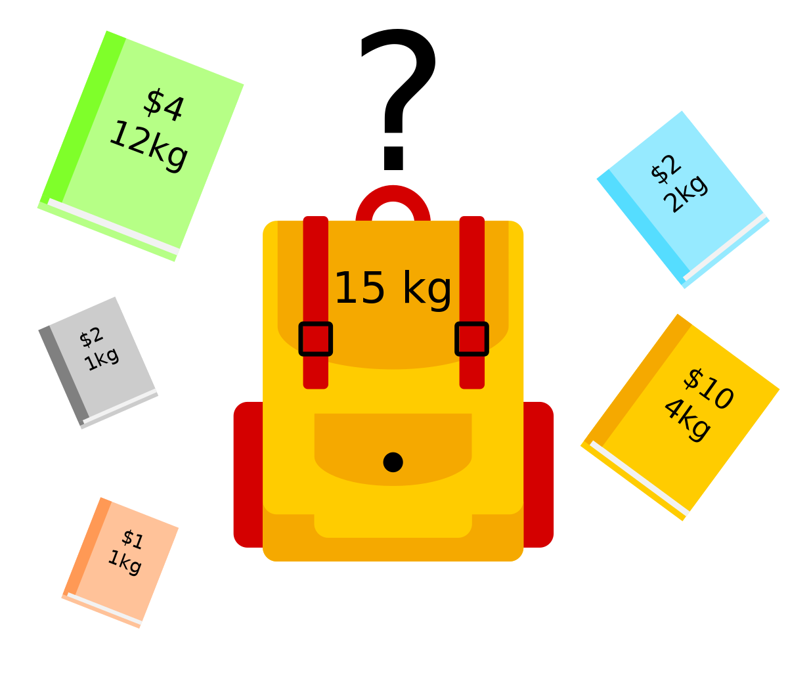
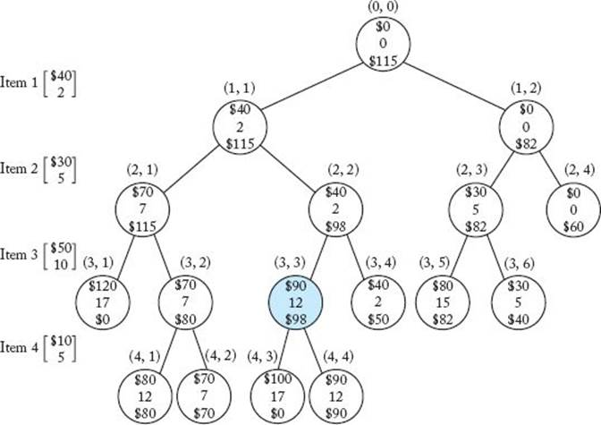
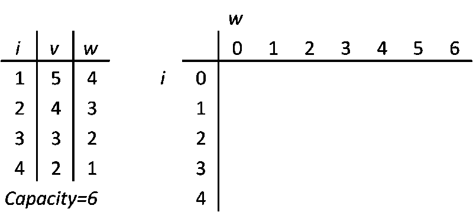
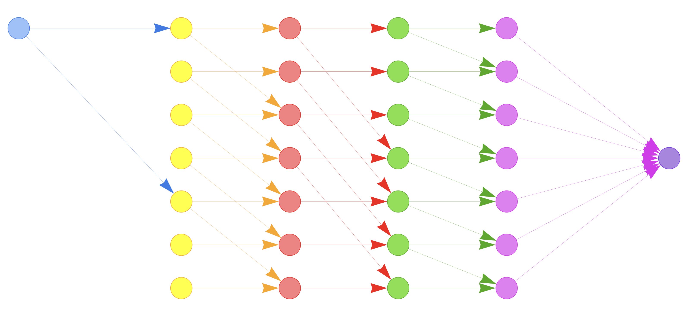
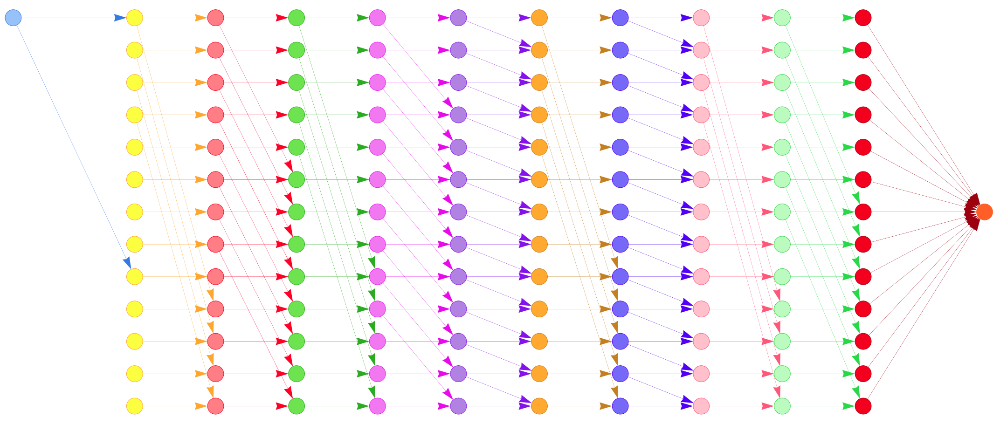

# **Knapsack Problem**

>  Questo è un progetto svolto nell'ambito degli esami di **Decision Scienze** *(a.k.a. Ricerca Operativa)* e **Network Flow Optimization** del **CdLM in Informatica** presso l'**Università degli Studi di Cagliari**

| **Studente**          | **Matricola** | **E-Mail**                        |
|-----------------------|---------------|-----------------------------------|
| Federico Meloni       | 60/73/65243   | <f.meloni62@studenti.unica.it>    |
| Luca Faccin           | 60/73/65236   | <l.faccin@studenti.unica.it>      |

<br>

---

<br>

> ### **Table of Content**
>  1. [Introduzione al problema](#introduzione-al-problema)
>  1. [Branch and bound](#branch-and-bound)
>      - [Esempio](#esempio)
>      - [Implementazione](#implementazione)
>  1. [Programmazione dinamica](#programmazione-dinamica)
>      - [Esempio](#esempio)
>      - [Implementazione](#implementazione)
>  1. [Shortest (Longest) Path Problem](#shortest-longest-path-problem)
>      - [Implementazione](#implementazione)
>      - [Esempio](#esempio)
>  1. [Risultati](#risultati)
>  1. [Requisiti, utilizzo ed output](#requisiti-utilizzo-ed-output)


```
REPOSITORY STRUCTURE
·
│
│ FOLDERS
├── source      //codice sorgente
│   └── main.py
|
├── images      //images for the readme
│   └── ...
│
│ FILES
├── README.md   //relazione e documentazione
└── .gitignore
```

<br>
<br>

## **Introduzione al problema**



Il *Problema dello Zaino* (o *Knapsack Problem*, *KP*) è un problema di ottimizzazione combinatoria che consiste nel trovare il modo più efficiente di riempire uno zaino con oggetti di vario peso e valore. Il problema è di tipo NP-hard, ovvero non esiste un algoritmo polinomiale che lo risolva in tempo polinomiale, ma esistono algoritmi che lo risolvono in tempo pseudo-polinomiale.

Il problema è formulato come segue: dato uno zaino di **capacità** $W$ e una serie di $N$ **oggetti**, ognuno caratterizzato da un **peso** $w$ e un **valore** $v$, trovare il modo di **riempire lo zaino in modo da massimizzare il valore totale degli oggetti inseriti, rispettando la capacità dello zaino**.

La **funzione obiettivo** da **massimizzare** è la seguente:
$$Z = \sum_{i=1}^{n} v_i \cdot x_i$$
$x_i$ è la variabile decisionale che indica se l'oggetto $i$ è stato inserito nello zaino o meno.

Il **vincolo** da rispettare invece è:
$$\sum_{i=1}^{n} w_i \cdot x_i \leq W$$

In base al tipo di variabile decisionale $x_i$ si possono avere tre tipi di KP:
- **0-1 Knapsack Problem**: $x_i \in \{0, 1\}$
- **Bounded Knapsack Problem**: $x_i \in \{0, 1, ..., b_i\}$
- **Unbounded Knapsack Problem**: $x_i \in \mathbb{N}$

**Nel progetto abbiamo trattato la tipologia 0-1 Knapsack Problem.**

Il problema viene trattato con tre diversi approcci:
- **Branch & Bound**: viene utilizzato CPLEX per risolvere il problema con un algoritmo di B&B
- **Programmazione Dinamica**: viene utilizzato un algoritmo di PD per risolvere il problema
- **Shortest (Longest) Path Problem**: viene modellato il problema come un problema di cammino minimo (massimo) su un grafo pesato
> *I primi due metori vengono trattati nel corso di **Decision Science**, mentre il terzo viene trattato nell'esame di **Network Flow Optimization***

<br>
<br>

## **Branch and Bound**
Il Branch and Bound è un paradigma di progettazione algoritmica utilizzato per risolvere problemi di ottimizzazione combinatoria. Questo approccio esplora tutte le possibili permutazioni tenendo conto dei vincoli, rendendolo più efficace rispetto ad altri approcci. Utilizzando **limiti (*bounds*)** e il **taglio (*pruning*)** delle soluzioni non fattibili, l'algoritmo ricerca in modo efficiente la soluzione ottimale.

Nel contesto del Knapsack Problem, l'algoritmo sfrutta una strategia di esplorazione ad albero per generare tutte le possibili combinazioni degli oggetti da mettere nello zaino. Durante la ricerca, vengono calcolati limiti superiori e inferiori per ogni nodo dell'albero, al fine di determinare quali rami dell'albero possono essere potati (tagliati) senza influire sulla ricerca della soluzione ottimale.

Inizialmente, l'algoritmo crea un nodo radice rappresentante lo stato iniziale del problema. Successivamente, genera i figli di questo nodo considerando le possibili scelte degli oggetti da mettere nello zaino. Calcola i limiti superiori e inferiori per ogni figlio e ordina i figli in base a questi limiti. Successivamente, l'algoritmo seleziona il figlio con il limite superiore più alto e lo esamina ulteriormente, generando i suoi figli e calcolando nuovi limiti. Questo processo continua fino a quando non vengono esplorate tutte le possibili combinazioni o fino a quando non viene trovata una soluzione ottimale.

L'utilizzo del Branch and Bound nel problema dello zaino permette di ridurre lo spazio di ricerca e di evitare l'esplorazione di soluzioni che sono sicuramente peggiori delle soluzioni già trovate. In questo modo, l'algoritmo riesce a trovare la soluzione ottimale in modo più efficiente rispetto ad altri approcci.

### **Esempio**
> Di seguito un Knapsack Problem di esempio risolto con Branch and Bound:
>
> 


### **Implementazione**
Per implementare il problema abbiamo utilizzato la libreria *docplex* per poter utilizzare l'ottimizzatore CPLEX tramite python.

Come passo di preprocessing, il vettore degli oggetti è stato ordinato secondo il ratio tra valore e peso in modo da poter avere il miglior risultato possibile, il ratio viene anche usato per impostare l'upper bound secondo la formula:

$$Ub = v + (W-w)*(v_{i+1}/w_{i+1})$$

Come primo passo viene creato un oggetto `Model` fornito da CPLEX. Questo modello rappresenta il problema dello zaino che deve essere risolto.

<details>
<summary> Codice </summary>
```python
# create model
model = Model(name='knapsack')
```
</details>

Vengono create le variabili corrispondenti agli oggetti utilizzando il metodo `.binary_var_list()` del modello. Sono variabili binarie, il che significa che possono assumere solo valori 0 o 1.

<details>
<summary> Codice </summary>
```python
# create variables
x = model.binary_var_list(len(items), name='x')
```
</details>

Viene impostata la funzione obiettivo utilizzando il metodo `.maximize()` del modello. La funzione obiettivo cerca di massimizzare il valore totale degli oggetti nello zaino, il quale viene calcolato facendo la somma della moltiplicazione tra ogni variabile binaria e il valore dell'oggetto corrispondente.

I vincoli vengono creati utilizzando il metodo `.add_constraint()`. Il vincolo impone che il peso totale degli oggetti nello zaino non superi la capacità massima del contenitore. Viene calcolato il peso totale moltiplicando il peso di ogni oggetto per la corrispondente variabile "x" e sommando i risultati. Il risultato totale deve essere inferiore o uguale alla capacità.

<details>
<summary> Codice </summary>
```python
# create objective function
model.maximize(model.sum([items[i].value * x[i] for i in range(len(items))]))
# create constraints
model.add_constraint(model.sum([items[i].weight * x[i] for i in range(len(items))]) <= capacity)
```
</details>

Viene impostata come strategia il Branch and Bound utilizzando `.set()` sull'oggetto `mip.strategy.branch`, il quale indicherà a CPLEX quale metodo usare durante la risoluzione del problema.

<details>
<summary> Codice </summary>
```python
# set branch and bound strategy
model.parameters.mip.strategy.branch.set(1)
```
</details>

Infine con `.solve()` si risolve il problema tramite il modello.

<details>
<summary> Codice </summary>
```python
# solve model
sol = model.solve()
```
</details>

<br>
<br>

## **Programmazione dinamica**

Questa tecnica si basa sull'idea di **suddividere il problema in sottoproblemi più piccoli**, risolverli separatamente e combinare le loro soluzioni per ottenere la soluzione globale.
Nel contesto del problema dello zaino, può essere utilizzata per risolvere la variante del problema **0-1 KP**.

L'approccio PD per risolvere il problema dello zaino coinvolge la creazione di una tabella, in cui **le righe rappresentano gli oggetti disponibili** e **le colonne rappresentano i pesi possibili dello zaino**. Ogni cella della tabella conterrà il valore massimo ottenibile considerando solo gli oggetti fino alla riga corrispondente e un peso massimo fino alla colonna corrispondente.

Il riempimento della tabella avviene in modo iterativo, calcolando i valori massimi per ogni cella sulla base dei valori precedentemente calcolati. Per ogni oggetto, si confronta il valore di includerlo nello zaino con il valore di escluderlo. Se includere l'oggetto porta a un valore complessivo maggiore, viene calcolato il valore massimo combinando l'oggetto con il valore ottenuto dai pesi rimanenti. Altrimenti, si copia il valore massimo della riga precedente.

Alla fine del processo, **la cella nell'angolo in basso a destra conterrà il valore massimo ottenibile**. Inoltre, **tracciando un percorso all'indietro attraverso la tabella, è possibile determinare quali oggetti sono stati inclusi nello zaino** per ottenere il valore massimo.

La formulazione matematica della matrice $V[i,j]$, dati i vettori del peso $w$ e del valore $v$ è:

$$
V[i,j] =
    \begin{cases}
      0 & \text{if $i$=0 o $j$=0}\\
      V[i-1,j] & \text{if $w_{i-1}$ > $j$}\\
      max(V[i-1,j],  v_{i-1}+V[i-1, j-w_{i-1}]) & \text{otherwise}
    \end{cases}
$$
### **Esempio**
> Di seguito è riportato un esempio di esecuzione dell'algoritmo con un problema di esempio:
>
> 


### **Implementazione**
L'implementazione della programmazione dinamica è stata fatta tramite una funzione: 
la quale prende in input il vettore degli oggetti e la capacità massima dello zaino, poi dichiara delle variabili ausilirie come ```n``` che è il numero di oggetti nel vettore, la tabella ```table``` per l'esecuzione dell'algoritmo vero e proprio, e infine ```selected``` in cui viene salvata la soluzione.

<details>
<summary> Codice </summary>

```python
def knapsack_dynamic(items: List[Item], capacity: int):
    n = len(items)
    table = [[0 for _ in range(capacity + 1)] for _ in range(n + 1)]
    selected = [0] * n
```
</details>

Adesso si costruisce la tabella con la quale si risolve il problema vero e proprio, all'interno di due for concatenati vengono eseguiti una serie di if ed else secondo la formulazione matematica mostrata di sopra.

<details>
<summary> Codice </summary>

```python
    for i in range(n + 1):
        for j in range(capacity + 1):
            if i == 0 or j == 0:
                table[i][j] = 0
            elif items[i - 1].weight <= j:
                table[i][j] = max(items[i - 1].value + table[i - 1][j - items[i - 1].weight], table[i - 1][j])
            else:
                table[i][j] = table[i - 1][j]
```
</details>

Infine, dopo aver dichiaato le due variabili ausiliarie `i=n` e `j=capacity`, si ripercorre la tabella al contrario per realizzare il vettore della soluzione, controllando se  un certo punto della tabella è diverso dal suo predecessore nella stessa riga, allora quell'oggetto sarà selezionato e il suo peso sarà sottratto da `j`.

<details>
<summary> Codice </summary>

```python
    i = n
    j = capacity
    while i > 0 and j > 0:
        if table[i][j] != table[i - 1][j]:
            selected[i - 1] = 1
            j -= items[i - 1].weight
        i -= 1

    return table[n][capacity], selected, j
```
</details>

<br>
<br>

## **Shortest (Longest) Path Problem**
Il problema del cammino minimo consiste nel trovare il cammino di costo minimo tra due nodi di un grafo pesato. Il problema può essere *"ribaltato"* per trovare il cammino di costo massimo tra due nodi di un grafo pesato andando a cambiare il segno dei costi degli archi.

**Il Knapsack Problem può essere modellato come un problema di cammino massimo su un grafo pesato.**

Il grafo è composto da $N \cdot (W+1) + 2$ nodi, dove $N$ **è il numero di oggetti** e $W$ **è la capacità dello zaino**, mentre i due nodi aggiuntivi corrispondono al nodo ***source*** e al nodo ***target***.  
Per ogni oggetto $x$ ci sono $W+1$ nodi, uno per ogni possibile peso attualmente presente nello zaino, quindi definiamo il nodo $x_i$ come il nodo corrispondente all'oggetto $x$ ($0 \le x < N$) quando stiamo occupando $i$ all'interno dello zaino, $0 \le i \le W$.  
Ogni nodo $x_i$ (ed il nodo source $s_0$) è collegato:
- al nodo $(x+1)_i$ con un arco di peso $0$
- al nodo $(x+1)_{i+(w+1)}$ con un arco di peso $v_x$ se $i+w_x \leq W$, altrimenti non è collegato a nessun altro nodo

I nodi corrispondenti all'ultimo oggetto sono collegati al nodo target $t$ con un arco di peso $0$.

Data la connettività che abbiamo definito, il grafo è un DAG (Directed Acyclic Graph), ed è pesato in modo tale che il cammino di costo massimo tra il nodo $s_0$ e il nodo $t$ corrisponde al valore massimo che possiamo ottenere riempiendo lo zaino.

Nel path massimo tra $s_0$ e $t$ ognuno dei nodi corrisponde ad un oggetto, quindi per ottenere la soluzione ottima (gli oggetti da inserire nello zaino) dobbiamo prendere i nodi che sono collegati al nodo precedente con un arco di peso $v_x > 0$. 

### **Implementazione**
Per implementare il problema abbiamo utilizzato la libreria *NetworkX* per la creazione del grafo e la libreria *pyvis* per la visualizzazione del grafo.

Dal punto di vista implementativo il nodo $s_0$ è il nodo $0$, mentre il nodo $t$ è il nodo $N \cdot (W+1) + 1$. I nodi corrispondenti agli oggetti sono i nodi da $1$ a $N \cdot (W+1)$.
Il grafo viene creato con la funzione `vector_to_nx()` che, preso in input il vettore degli oggetti e la capacità dello zaino, crea il grafo di tipo `DiGraph` e lo restituisce. Ricordiamo che gli archi all'interno del grafo hanno peso pari all'opposto del valore dell'oggetto che collegano in quanto vogliamo trovare il cammino massimo usando l'algoritmo del cammino minimo.

Per trovare il cammino minimo (massimo), dato che il grafo è un DAG, viene inizialmente eseguito un topological sort del grafo, il quale può essere eseguito con complesità computazionale $O(m)$, dove $m$ è il numero di archi.

<details>
<summary> Codice </summary>

```python
# topological sort of an acyclic directed graph
visited = [False] * g.number_of_nodes()
stack = []

for i in range(g.number_of_nodes()):
    if not visited[i]:
        topological_sort(g, s, visited, stack)

def topological_sort(g, v, visited, stack):
    # mark the current node as visited
    visited[v] = True

    # recur for all adjacent vertices of v
    for i in g.neighbors(v):
        if visited[i] == False:
            topological_sort(g, i, visited, stack)

    stack.append(v)
```

</details>

Dopo aver eseguito il topological sort vengono calcolate le distanze minime tra il nodo $s_0$ e tutti gli altri nodi del grafo, andando a visitare tutti i nodi nello stack restituito dal topological sort.

<details>
<summary> Codice </summary>

```python
dist = [float('inf')] * g.number_of_nodes()
dist[s] = 0

while stack:
    u = stack.pop()

    # update distance for all adjacent nodes
    for v in g.neighbors(u):
        if dist[v] > dist[u] + g[u][v]['weight']:
            dist[v] = dist[u] + g[u][v]['weight']
```

</details>

Una volta calcolate le distanze minime (che ricordiamo sono distanze massime dato che i pesi degli archi sono negativi) viene costruito il cammino minimo (massimo) tra il nodo $s_0$ e il nodo $t$.

Per prima cosa si trova il nodo predecessore di $t$ tra gli $W+1$ nodi corrispondenti all'ultimo oggetto, ovvero il nodo predecessore con la stessa distanza di $t$ dal nodo $s_0$.

<details>
<summary> Codice </summary>

```python
idx = g.number_of_nodes()-1
path.append(idx)
for pred in g.predecessors(idx):
    if dist[pred] == dist[g.number_of_nodes()-1]:
        idx = pred
        path.append(idx)
        break
```

</details>

Una volta trovato il primo predecessore si torna indietro nel grafo fino a raggiungere il nodo $s_0$. Ogni nodo d'ora in poi avrà al più due predecessori, quindi si sceglie il predecessore che ha distanza uguale alla distanza del nodo corrente meno il peso dell'arco che li collega. Come ultima cosa si inverte il cammino trovato in quanto è stato costruito partendo dal nodo $t$.

<details>
<summary> Codice </summary>

```python
while idx > 0:
    pred = list(g.predecessors(idx))
    #print(pred)
    if pred[0] == 0 or dist[idx] == dist[pred[0]] + g[pred[0]][idx]['weight']:
        idx = pred[0]
    else:
        idx = pred[1]
    #print(idx)
    path.append(idx)
path.reverse()
```

</details>

Come ultima cosa vengono selezionati gli oggetti che vengono inseriti nello zaino. Dato il path $p$, per riconoscere gli oggetti si prendono i nodi che sono collegati al nodo precedente con un arco di peso diverso da zero, quindi la distanza del nodo $p_i$ da $s_0$ è diversa dalla distanza del nodo $p_{i-1}$ da $s_0$.

### **Esempio**

> Prendiamo in considerazione il seguente KP
>
> $W = 5$
> | $x$ | 0   | 1   | 2   | 3   |
> |:---:| --- | --- | --- | --- |
> | $v$ | 40  | 15  | 20  | 10  |
> | $w$ | 4   | 2   | 3   | 1   |
>
> Il grafo costruito sarà il seguente:
> 
> 
> 
> Il cammino di costo massimo tra il nodo $s_0$ e il nodo $t$ è il seguente:  
> [ $s_0$, $0_4$, $1_6$, $2_6$, $3_6$, $t$]
> 
> Gli oggetti selezionati sono quindi $x = [0, 1]$  
> Il valore totale è $Z = 40 + 15 = 55$

<br>
<br>


## **Risultati**

Prendiamo in considerazione il seguente KP:

$W = 12$
| $x$ | 0   | 1   | 2   | 3   | 4   | 5   | 6   | 7   | 8   | 9   |
|:---:| --- | --- | --- | --- | --- | --- | --- | --- | --- | --- |
| $v$ | 2   | 10  | 5   | 4   | 2   | 7   | 10  | 10  | 8   | 1   |
| $w$ | 8   | 9   | 5   | 8   | 3   | 1   | 8   | 1   | 9   | 6   |


Questo è uno dei casi in cui i vari metodi di risoluzione non trovano tutti la stessa soluzione, pur assicurando tutti la soluzione ottima.

| Metodo | Profitto | Capacità residua | Tempo                 | Soluzione |
| ------ | -------- | ---------------- | --------------------- | --------- |
| BB     | 27       | 2                | 0.04172015190124512   | [5, 6, 7] |
| PD     | 27       | 1                | 4.1961669921875e-05   | [1, 5, 7] |
| SP     | 27       | 2                | 0.0005588531494140625 | [5, 6, 7] |

<details>
<summary> Grafo generato </summary>



</details>

I casi in cui i metodi trovano soluzioni diverse sono quelli in cui ci sono più oggetti con lo stesso profitto e peso oppure quando ci sono oggetti con stesso profitto e peso simile, come nel caso in esame tra gli oggetti 1 e 6, quindi prendere un oggetto al posto dell'altro non cambia il profitto totale, in quanto entrambi ci stanno nello zaino e prendere quello col peso minore non ci permette di prendere altri oggetti.

Successivamente siamo andati ad effettuare dei test su un numero di oggetti crescente per vedere come si comportano i vari metodi. Per tutti i test abbiamo utilizzato un peso fissato.

$W=18$
| Numero oggetti  | BB    | PD    | SP    | BB (tempo)               | PD (tempo)                | SP (tempo)               | Stessa soluzione |
| --------------- | ----- | ----- | ----- | ------------------------ | ------------------------- | ------------------------ | ---------------- |
| 10              | 44    | 44    | 44    | 0.009273052215576172     | 4.410743713378906e-05     | 0.0006861686706542969    | SI               |
| 50              | 132   | 132   | 132   | 0.021244049072265625     | 0.00021195411682128906    | 0.0040531158447265625    | SI               |
| 100             | 196   | 196   | 196   | 0.012026071548461914     | 0.00036001205444335940    | 0.0064010620117187500    | SI               |
| 500             | 269   | 269   | 269   | 0.026194810867309570     | 0.00209403038024902340    | 0.0533699989318847660    | SI               |
| 1000            | 431   | 431   | 431   | 0.023194789886474610     | 0.00406789779663085900    | 0.0905468463897705100    | NO               |

Come possiamo notare dai risultati, i metodi trovano sempre la stessa soluzione, anche se gli oggetti selezionati non sono sempre gli stessi.  
Inoltre, come ci aspettavamo, il tempo di esecuzione cresce all'aumentare del numero di oggetti, in particolare per il metodo SP, che è quello che impiega più tempo, mentre il metodo PD è quello che impiega meno tempo.

> NOTE:
> Il tempo di esecuzione è stato calcolato utilizzando la funzione `time()` della libreria `time` di Python, che restituisce il tempo in secondi con una precisione di 1 microsecondo. Per quanto riguarda il metodo SP, il tempo di esecuzione comprende anche il tempo di creazione del grafo.

<br>
<br>

## **Requisiti, utilizzo ed output**


<details>
<summary> <h3><b>Requisiti</b></h3> </summary>

Requisiti per l'utilizzo del progetto:
- Python 3.9+ - *quello con cui abbiamo eseguito il progetto, potrebbe funzionare anche con versioni precedenti*
- pip 21.0+ - *quello con cui abbiamo eseguito il progetto, potrebbe funzionare anche con versioni precedenti*
- ILOG CPLEX Optimization Studio 22.1.1 - [[download link](https://www.ibm.com/it-it/products/ilog-cplex-optimization-studio)]

> Note:
> in base alla versione di Python installata potrebbe essere necessario utilizzare `pip3` al posto di `pip` e `python3` al posto di `python`

</details>


<details>
<summary> <h3><b>Utilizzo</b></h3> </summary>

Clonata la repository, consigliamo di creare una propria `venv` dentro la cartella source:
```bash
cd <path_to_this_repo>/source
python -m venv <virtual_environment_name>
source <virtual_enviroment_name>/bin/activate
```

Nel progetto è stato utilizzato `docplex` (interfaccia Python per CPLEX) per la risoluzione del problema tramite Branch & Bound, mentre `networkx` e `pyvis` sono stati utilizzati rispettivamente per la creazione e la visualizzazione dei grafi.

Per installare le dipendenze:
```bash
# DS: installazione di docplex
python <path_to_CPLEX>/python/setup.py install
# NFO: networkx e pyvis per la creazione e visualizzazione dei grafi
pip install networkx
pip install pyvis
```

Una volta installate le dipendenze si può eseguire il progetto
```bash
python main.py
```

</details>


<details>
<summary> <h3><b>Output</b></h3> </summary>

Il progetto produrrà in output il log di un test con una lista di items generata casualmente e una capacità dello zaino cauale secondo il pattern:
```
List of items:
Itm[0]:  value 7        weight 1
...
Itm[n]:  value 5        weight 10
Capacity: 10

========================================

<Tipo di algoritmo per la soluzione>
Profit = 28, Residual capacity = 2
x[0] = 1
x[3] = 1
...
x[7] = 1
Time = 0.033518075942993164

========================================

...

```

Insime al log verrà prodotto un grafo che rappresenta la modellazione del problema come shortest (longest) path problem. Il grafo verrà salvato nella cartella `source` con il nome `graph.html` e sarà visualizzabile tramite il proprio browser.

Successivamente verrà effettuato un 5 test con numero di items crescente [10, 50, 100, 500, 1000] e capacità dello zaino fissa, e verrà prodotto un log del tipo:
```
Number of items: 10
FObj BB: 37, Time BB: 0.01954793930053711
FObj PD: 37, Time PD: 3.695487976074219e-05
FObj SP: 37, Time SP: 0.00022411346435546875
Same solution: True

...
```
</details>
